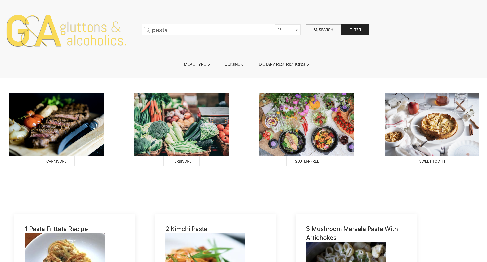
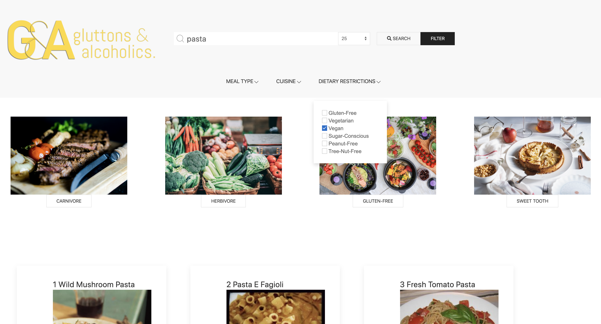

# gluttons and alcoholics

**User Story**
With the COVID-19 pandemic shuttering restaurants and keeping everyone athome more often, we are spending more time in our kitchens. Hot Pockets can only carry us so far. Where can we come up with ideas for meals at home that meet our dietary needs? How can we mix in an adult beverage to relax after a particularly tough day?

Enter Gluttons and Alcoholics. Pick the ingredients you have on hand or want to incorporate into your next meal. Filter your search by cuisine or dietary restrictions. Explore #recipes that fit your request. You will even find a drink you may never have heard of to pair with your next meal.

**Libraries/Framework**
* jQuery
* UIkit (CSS framework)
* EDAMAM Recipe API
* CocktailDB API

**Process**
1. Created base HTML
2. Made API calls to get: 
 - Recipes
 - Cocktails
3. Dynamically displaying results on HTML
4. Timing issues with displaying results in modals
5. Working on filtering criteria

**Next Steps**
* Create rules for drink pairings (instead of random)
* Let user bookmark recipes
* Let user create grocery list 
* Link list to grocery store api to check product availability
* Include map of nearest grocery stores

**Screenshots**
The following image demonstrates the application functionality:

**URL link to recipe app**
https://brianlevin.github.io/gluttons-and-alcoholics